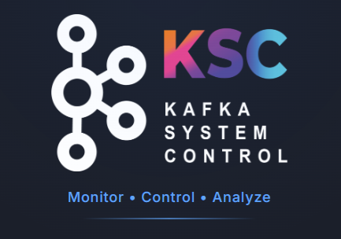

# Kafka System Control

<p align="left">
  <a href="https://github.com/Egorich88/kafka-system-control-4/blob/main/LICENSE">
    
  </a>
  <a href="https://github.com/Egorich88/kafka-system-control-4/releases">
    
  </a>
  <a href="https://github.com/Egorich88/kafka-system-control-4/actions/workflows/ci-cd.yml">
    
  </a>
</p>

**Kafka System Control** — современный веб‑интерфейс для администрирования Apache Kafka.  
Построен на **Go** и **React** с нуля, от консольных утилит до production‑готового микросервиса с CI/CD, контейнеризацией и деплоем в Kubernetes.



---

## ✨ Ключевые возможности

- **Интуитивный UI** – тёмная тема, боковое меню, переключение между несколькими кластерами Kafka.
- **Управление топиками** – просмотр, создание, удаление, изменение конфигурации (retention, cleanup.policy и др.).
- **Поиск сообщений** – чтение сообщений из выбранной партиции с фильтром по offset и лимиту.
- **Многокластерность** – добавление кластеров с разными типами аутентификации (PLAINTEXT, SASL/SCRAM, mTLS в плане).
- **CI/CD из коробки** – автоматическая сборка, публикация образов в Docker Hub и создание GitHub Release при пуше тега.
- **Контейнеризация** – готовые Docker‑образы для бэкенда и фронтенда.
- **Развёртывание в K8s** – манифесты и Terraform для Yandex Cloud.

> ⏳ **В активной разработке:** дашборд мониторинга, управление группами потребителей (сброс офсетов), ACL, встроенный терминал.

---

## 🏗️ Архитектура


| Компонент       | Технологии                                                                 |
|----------------|----------------------------------------------------------------------------|
| **Frontend**   | React, Vite, Axios, CSS Modules                                           |
| **Backend**    | Go, Sarama (Kafka Admin API), net/http                                    |
| **Инфраструктура** | Docker, Docker Compose, GitHub Actions, Docker Hub, Terraform, Yandex Cloud |
| **Оркестрация**   | Kubernetes (Yandex Managed Kubernetes)                                   |

---

## 🚀 Быстрый старт

### Локальная разработка

1. **Клонируйте репозиторий**
   ```bash
   git clone https://github.com/Egorich88/kafka-system-control-4.git
   cd kafka-system-control-4
   
2. **Запустите бэкенд (требуется работающая Kafka на localhost:9092)**
   ```bash
   cd backend
   go run main.go
   
3. **Запустите фронтенд (в другом терминале)**
   ```bash
   cd frontend
   npm install
   npm run dev

4. **Откройте http://localhost:5173 – интерфейс готов к работе.**

## Docker Compose (всё в одном)
  ```bash
   docker-compose up --build
   ```
  - Фронтенд: http://localhost:5173
  - Бэкенд: http://localhost:8080/api/topics

## 🔁 CI/CD (GitHub Actions)

При каждом пуше в ветку main или создании тега v* автоматически:

- Собираются Docker‑образы бэкенда и фронтенда.

- Образы публикуются в Docker Hub (egorich27/kafka-control-backend, egorich27/kafka-control-frontend).

- При пуше тега дополнительно создаётся GitHub Release с приложенными архивами исходного кода и автоматическим описанием изменений (используется generate_release_notes).

|🧪 Ручной запуск деплоя в Kubernetes возможен через флаг deploy в GitHub Actions.

## 📦 Релизы
Вся история версий доступна на странице Releases.
Каждый релиз включает:

- Docker‑образы, готовые к использованию.

- Подробный changelog (автоматически собирается из коммитов).

Архив исходного кода.

## 🗺️ Планы развития

- ✅ Веб‑интерфейс (React + Go)
- ✅ Docker‑образы и CI/CD
- ✅ Автоматические релизы по тегам
- ✅ Переключение кластеров (фронт + бэк)
- ✅ Развёртывание в Kubernetes (Yandex Cloud)
- ✅ Управление конфигурацией топиков (retention, cleanup.policy)
- ✅ Поиск сообщений (по партиции, offset)
- ⏳ Дашборд мониторинга (графики лага, throughput, ошибки)
- ⏳ Управление группами потребителей (просмотр, сброс офсетов)
- ⏳ Управление ACL (список, создание, удаление)
- ⏳ Встроенный терминал (web‑shell для Kafka CLI)
- ⏳ Поддержка Kafka Connect и Kafka Streams

## 🤝 Автор
Egorich88
Проект создан как демонстрация современных DevOps‑подходов: от консольных скриптов до production‑готовых микросервисов с полным CI/CD.

«Movement – life!»

## 📄 Лицензия
Этот проект распространяется под лицензией Apache License 2.0. Подробности в файле LICENSE.

## ⚠️ Товарный знак
Название «Kafka» и логотип Kafka являются зарегистрированными товарными знаками The Apache Software Foundation (ASF).
Kafka System Control — это независимый инструмент с открытым исходным кодом, предназначенный для управления кластерами Apache Kafka.
KSC не является частью Apache Kafka, не поддерживается и не спонсируется ASF.
Все упоминания «Kafka» и «Кафка» используются исключительно в техническом смысле для обозначения совместимой технологии.
