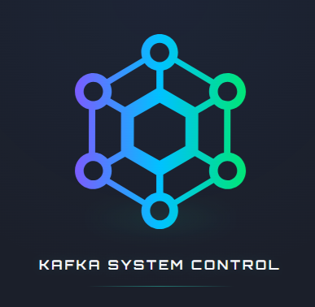

# Kafka System Control

<p align="left">
  <a href="https://github.com/Egorich88/kafka-system-control-4/blob/main/LICENSE">
    
  </a>
  <a href="https://github.com/Egorich88/kafka-system-control-4/releases">
    
  </a>
  <a href="https://github.com/Egorich88/kafka-system-control-4/actions/workflows/ci-cd.yml">
    
  </a>
</p>

**Kafka System Control** is a modern web UI for Apache Kafka administration. Built from scratch with **Go** and **React**, it evolved from console scripts into a production-ready microservice featuring CI/CD, containerization, and Kubernetes deployment.

## ✨ Key Features

- **Intuitive UI** – Dark theme, sidebar navigation, multi‑cluster switching.
- **Topic Management** – View, create, delete, and edit topic configuration (retention, cleanup.policy, etc.).
- **Message Search** – Read messages from a selected partition with offset and limit filters.
- **Multi‑cluster** – Add clusters with different authentication types (PLAINTEXT, SASL/SCRAM, mTLS planned).
- **CI/CD out of the box** – Automatic builds, Docker Hub publishing, and GitHub Release creation on tag push.
- **Containerized** – Ready‑to‑use Docker images for backend and frontend.
- **K8s Deployment** – Manifests and Terraform for Yandex Cloud.

> ⏳ **In active development**: monitoring dashboard, consumer group management (offset reset), ACL, built‑in terminal.

## 🏗️ Architecture

| Component       | Technologies                                                                 |
|----------------|------------------------------------------------------------------------------|
| **Frontend**   | React, Vite, Axios, CSS Modules                                             |
| **Backend**    | Go, Sarama (Kafka Admin API), net/http                                      |
| **Infrastructure** | Docker, Docker Compose, GitHub Actions, Docker Hub, Terraform, Yandex Cloud |
| **Orchestration** | Kubernetes (Yandex Managed Kubernetes)                                    |

## 🚀 Quick Start

### Local Development

1. **Clone the repository**
   ```bash
   git clone https://github.com/Egorich88/kafka-system-control-4.git
   cd kafka-system-control-4

2. **Run the backend (requires a running Kafka instance at localhost:9092)**
   ```bash
   cd backend
   go run main.go

3. **Run the frontend (in another terminal)**
   ```bash
   cd frontend
   npm install
   npm run dev

4. **Open http://localhost:5173 – the UI is ready.**

## Docker Compose (all‑in‑one)
   ```bash
   docker-compose up --build
   ```

## 🔁 CI/CD (GitHub Actions)
On every push to main or creation of a v* tag, the pipeline automatically:

- Builds Docker images for backend and frontend.

- Publishes them to Docker Hub (egorich27/kafka-control-backend, egorich27/kafka-control-frontend).

- On tag push, additionally creates a GitHub Release with source archives and auto‑generated changelog (generate_release_notes).

| 🧪 Manual deployment to Kubernetes is possible via the deploy flag in GitHub Actions.

## 📦 Releases
All version history is available on the Releases page. Each release includes:

- Ready‑to‑use Docker images.

- Detailed changelog (automatically collected from commits).

- Source code archive.

## 🗺️ Development Roadmap
  - ✅ Web UI (React + Go)

  - ✅ Docker images & CI/CD

  - ✅ Automatic releases on tags

  - ✅ Cluster switching (frontend + backend)

  - ✅ Kubernetes deployment (Yandex Cloud)

  - ✅ Topic configuration management (retention, cleanup.policy)

  - ✅ Message search (by partition, offset)

  - ✅ Monitoring dashboard (lag graphs, throughput, errors)

  - ⏳ Consumer group management (view, offset reset)

  - ⏳ ACL management (list, create, delete)

  - ⏳ Built‑in terminal (web shell for Kafka CLI)

  - ⏳ Kafka Connect & Kafka Streams support

## 🤝 Author
Egorich88
The project demonstrates modern DevOps practices: from console scripts to production‑ready microservices with full CI/CD.

“Movement – life!”

## 📄 License
This project is licensed under the Apache License 2.0. See the LICENSE file for details.

## ⚠️ Trademark Notice
The name “Kafka” and the Kafka logo are registered trademarks of The Apache Software Foundation (ASF).
Kafka System Control is an independent open‑source tool designed to manage Apache Kafka clusters.
KSC is not part of Apache Kafka, nor is it supported or sponsored by the ASF.
All mentions of “Kafka” are used solely in a technical sense to indicate compatible technology.