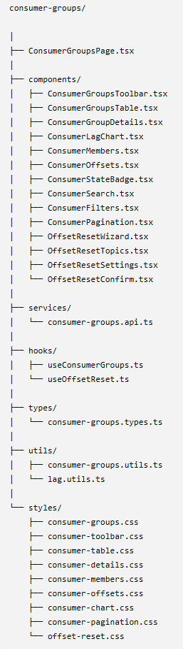

# Архитектура Consumer Groups:

---

## Описание папок и файлов:
**ConsumerGroupsPage.tsx** - главная страница

---

**components/** - содержит только React-компоненты, никакой бизнес-логики, никаких axios, никаких запросов, только отображение.

    ConsumerGroupsTable.tsx 
отвечает исключительно за отображение таблицы.Не знает, откуда пришли данные.

---

**services/** - здесь лежит работа с Backend.

    consumer-groups.api.ts 
будет содержать:
- getConsumerGroups()
- getConsumerGroup()
- resetOffsets()
- deleteGroup()
- pauseGroup()
- resumeGroup()

То есть только HTTP.

---

**hooks/** - содержит кастомные React Hooks.

    useConsumerGroups() 
будет:
- загружать данные
- обновлять
- кешировать
- хранить loading
- хранить error

---

Во всех страницах останется:

    const {
        groups,
        loading,
        refresh
    } = useConsumerGroups();

и всё.

---

**utils/** - любые вычисления.

Lag

    1234567

↓

    1.23M

или

    Stable

↓

    🟢 Stable

---

**types/** - содержит интерфейсы TypeScript. 

    export interface ConsumerGroup {

    }
Никакой логики, только типы.

---

**styles/** - содержит стили css

